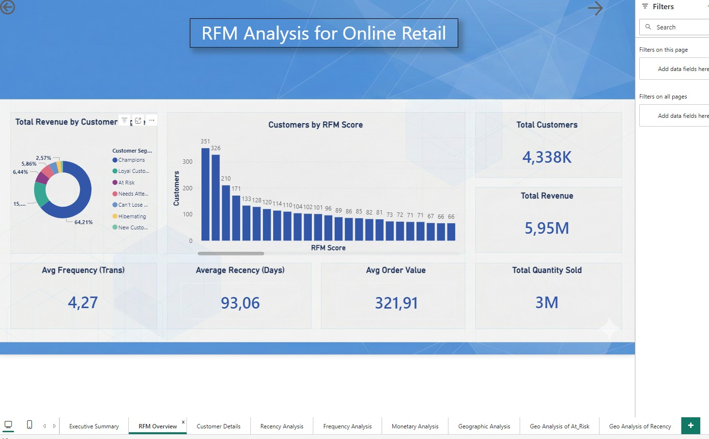
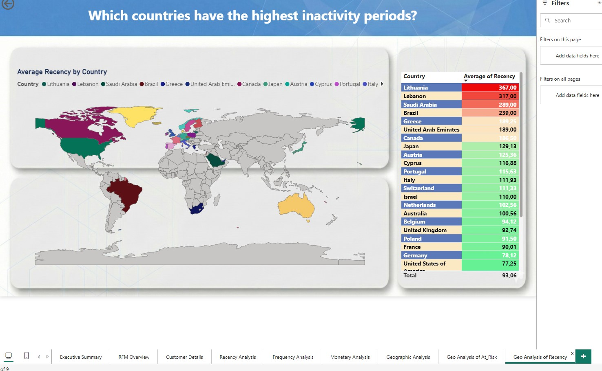

# 🚀 E-Commerce Customer Segmentation (RFM Analysis)

## 📌 Project Overview
This end-to-end project analyzes customer purchasing behavior for a UK-based online retail store. Using **Python** for ETL, **SQL** for data modeling, and **Power BI** for visualization, I segmented customers to optimize marketing strategies.

**Live Demo Video:** www.linkedin.com/in/ilkkanyavuz

## 🛠️ Tech Stack & Architecture
* **Python (Pandas):** Used for ETL (Extract, Transform, Load), data cleaning, and feature engineering (calculating `Total Sales`).
* **Microsoft SQL Server:** The core database engine used for storing data, calculating RFM metrics, applying `NTILE` scoring, and executing the complex `CASE WHEN` segmentation logic.
* **Power BI:** Used for data modeling (DAX), creating interactive dashboards, and visual storytelling.

## 🔍 Key Findings & Insights
The analysis revealed critical patterns in customer behavior, validating the Pareto Principle:

* **The 80/20 Rule Validated:** The **'Champions'** segment represents only **23.23%** of the total customer base but generates **64.21%** of the total revenue.
* **Critical Retention Warning:** The **'Customers At Risk'** segment has an average inactivity period of **161 days**. This timeframe marks the critical danger zone where immediate win-back campaigns are required.
* **Overall Health:** The customer base is generally active, with an **Average Recency** of **93.6 days**.

## 📸 Dashboard Preview

---
*Developed by **İLKKAN YAVUZ** under the brand **Apex Analytics**.*
